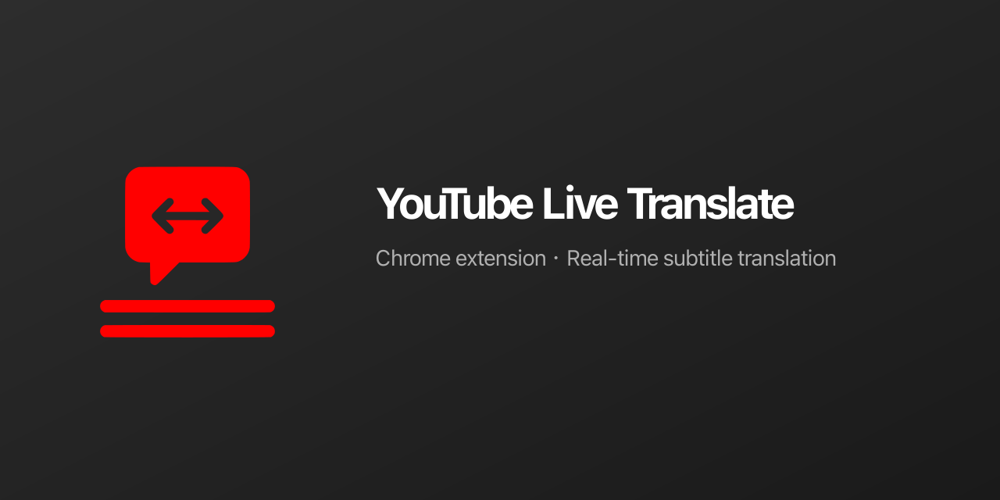

# YouTube Live Translate

> 🌍 Chrome extension for real-time YouTube subtitle translation — break language barriers and enjoy global video content.

[](https://github.com/wangruofeng/youtube-live-translate)
[](LICENSE)
[](https://github.com/wangruofeng/youtube-live-translate)

**中文说明请见 [README_ZH.md](README_ZH.md)。**

## ✨ Features

### 🎯 Core

- **Real-time subtitle translation** — Listens to YouTube captions and translates into your target language on the fly
- **Dual-line display** — Original text on top, translation below
- **Smart refresh** — Updates only when needed to avoid flicker
- **Draggable overlay** — Move the subtitle box anywhere; position is saved
- **Ad detection** — Hides the overlay during YouTube ads
- **Hide original captions** — Option to hide YouTube’s built-in captions and show only the translation

### ⌨️ Shortcut

- **Toggle extension on/off**: `Alt + E` (Windows/Linux) or `Option + E` / `Command + E` (Mac)

### 🌐 Languages

30+ target languages (e.g. 简体/繁體中文, English, 日本語, 한국어, Español, Français, Deutsch, Italiano, Português, Русский, العربية, and more). Popup UI in English, 简体中文, or 繁體中文.

## 📸 Preview

```
┌────────────────────────────────────────┐
│  ━━━                                 │ ← Drag area
│  Original: Oh boy. Okay. No. uh...    │ ← Original (semi-transparent)
│  Translation: 天哪。好吧。不，呃...   │ ← Translation (white, max 2 lines)
│                              ✕       │ ← Close button
└────────────────────────────────────────┘
```

## 🚀 Quick Start

### Install

1. Download the latest [youtube-live-translate.zip](https://github.com/wangruofeng/youtube-live-translate/releases) (or clone the repo and run `npm run build`)
2. Unzip (if needed)
3. Open Chrome and go to `chrome://extensions/`
4. Turn on **Developer mode**
5. Click **Load unpacked** and select the extension folder (e.g. `dist/` after build)
6. Pin the extension icon if you like

### Use

1. Open a YouTube video and turn on captions
2. The translation overlay appears at the bottom center of the player
3. Click the extension icon to open settings:
   - Enable/disable translation
   - Target language
   - Show/hide original text
   - Hide YouTube’s original captions
   - Text alignment (left / center / right)
   - Translation font size (small / medium / large)
   - UI language (English / 简体中文 / 繁體中文)

> **Social preview**：在 GitHub **Settings → General → Social preview** 上传 [social-preview.png](social-preview.png)（`npm run social-preview` 生成，1280×640）。

## 🛠️ Tech Stack

- **Chrome Extension Manifest V3**
- **React 18** — Popup UI
- **TypeScript**
- **Webpack 5**
- **Google Translate API** (public endpoint) for translation

## 📖 Docs

- [Product & features (中文)](docs/PRODUCT.md)
- [Architecture (中文)](docs/ARCHITECTURE.md)
- [Testing (中文)](docs/TESTING.md)
- [API (中文)](docs/API.md)
- [Changelog](docs/CHANGELOG.md)

## 🔧 Development

### Requirements

- Node.js >= 16
- npm >= 8

### Commands

```bash
git clone https://github.com/wangruofeng/youtube-live-translate.git
cd youtube-live-translate

npm install
npm run dev           # watch mode
npm run build         # production build
npm run icons         # generate extension icons (16/32/48/128/512)
npm run social-preview # generate 1280×640 social-preview.png
npm run clean         # remove dist/
# Optional: npm run build && zip -r youtube-live-translate.zip dist/
```

### Project structure

```
youtube-live-translate/
├── public/           # Static assets, manifest, icons (icon.svg → 16/32/48/128/512)
├── scripts/          # generate-icons.js, generate-social-preview.js
├── src/
│   ├── popup/        # Extension popup (React, i18n: en/zh-CN/zh-TW)
│   ├── content/      # Injected script (YouTube page)
│   └── background/   # Service worker
├── dist/             # Build output
├── docs/             # Documentation (Chinese)
├── social-preview.png # GitHub social preview (1280×640, npm run social-preview)
└── webpack.config.js
```

## 🤝 Contributing

Issues and Pull Requests are welcome.

1. Fork the repo
2. Create a branch (`git checkout -b feature/AmazingFeature`)
3. Commit (`git commit -m 'Add some AmazingFeature'`)
4. Push (`git push origin feature/AmazingFeature`)
5. Open a Pull Request

## 📄 License

[MIT](LICENSE)

## 🙏 Thanks

- [Google Translate](https://translate.google.com/) — Translation
- [YouTube](https://www.youtube.com/) — Video platform
- [Chrome Extension docs](https://developer.chrome.com/docs/extensions/) — Official docs

## 📮 Contact

- **Author**: wangruofeng  
- **Email**: wangruofeng007@gmail.com  
- **Repo**: [github.com/wangruofeng/youtube-live-translate](https://github.com/wangruofeng/youtube-live-translate)

---

⭐ If this project helps you, give it a Star!
