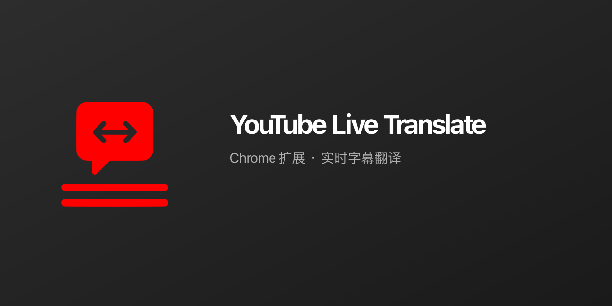

# YouTube Live Translate

> 🌍 YouTube 实时字幕翻译 Chrome 扩展 - 打破语言障碍，畅享全球视频内容

[](https://github.com/wangruofeng/youtube-live-translate)
[](LICENSE)
[](https://github.com/wangruofeng/youtube-live-translate)

## ✨ 功能特性

### 🎯 核心功能

- **实时字幕翻译** - 自动监听 YouTube 字幕并实时翻译成目标语言
- **双行显示** - 原文和译文同时显示，原文在上，译文在下
- **智能刷新** - 追加模式刷新，只在必要时更新界面，避免闪烁
- **拖拽定位** - 支持拖拽字幕控件到任意位置，位置自动保存
- **广告检测** - 自动检测广告播放，广告期间隐藏字幕
- **隐藏原字幕** - 可选择隐藏 YouTube 原生字幕，只显示翻译

### ⌨️ 快捷键

- **开启/关闭插件**：`Alt + E`（Windows/Linux）或 `Option + E` / `Command + E`（Mac），用于快速切换翻译启用状态

### 🌐 支持语言

目标翻译语言 30+ 种（如简体/繁體中文、English、日本語、한국어、Español、Français、Deutsch、Italiano、Português、Русский、العربية、हिन्दी、ไทย 等）。弹窗界面语言：English、简体中文、繁體中文。

## 📸 界面预览

### 插件界面 - 深色主题

<table>
  <tr>
    <td width="50%">
      
    </td>
    <td width="50%">
      
    </td>
  </tr>
</table>

### 字幕翻译示例

<table>
  <tr>
    <td></td>
    <td></td>
  </tr>
  <tr>
    <td><strong>英语 → 简体中文</strong></td>
    <td><strong>中文 → 英语</strong></td>
  </tr>
  <tr>
    <td></td>
    <td></td>
  </tr>
  <tr>
    <td><strong>英语 → 日语</strong></td>
    <td><strong>英语 → 韩语</strong></td>
  </tr>
  <tr>
    <td colspan="2"></td>
  </tr>
  <tr>
    <td colspan="2"><strong>英语 → 阿拉伯语（RTL 语言支持）</strong></td>
  </tr>
</table>

### 字幕布局

```
┌────────────────────────────────────────┐
│  ━━━                                 │ ← 拖拽区域
│  原文：Oh boy. Okay. No. uh Nvidia... │ ← 原文（半透明白色）
│  译文：天哪。好吧。不，呃，英伟达... │ ← 译文（白色，最大2行）
│                              ✕       │ ← 关闭按钮
└────────────────────────────────────────┘
```

### 演示视频

<div align="center">

Demo 视频演示

https://github.com/user-attachments/assets/8fff06ba-fcf2-4265-b47b-00958f97dd20

</div>

## 🚀 快速开始

### 安装方法

1. 下载最新版本的 [youtube-live-translate.zip](https://github.com/wangruofeng/youtube-live-translate/releases)

2. 解压文件

3. 打开 Chrome 浏览器，访问 `chrome://extensions/`

4. 开启"开发者模式"

5. 点击"加载已解压的扩展程序"

6. 选择解压后的文件夹，选择 /dist 目录

### 使用方法

1. 访问 YouTube 并播放带有字幕的视频

2. 字幕翻译控件会自动出现在屏幕中下方

3. 点击浏览器工具栏的扩展图标打开设置面板

4. 在设置面板中可以：
   - 启用/禁用翻译
   - 选择目标语言
   - 显示/隐藏原文
   - 隐藏 YouTube 原字幕
   - 翻译内容对齐（左/中/右）
   - 译文字体大小（小/中/大，默认中）
   - 界面语言（English / 简体中文 / 繁體中文）

> **Social preview**：在 GitHub **Settings → General → Social preview** 上传 [social-preview.png](social-preview.png)（运行 `npm run social-preview` 生成，1280×640）。

## 🛠️ 技术栈

- **Chrome Extension Manifest V3** - 最新的扩展程序标准
- **React 18** - UI 框架
- **TypeScript** - 类型安全的开发体验
- **Webpack 5** - 模块打包工具
- **Google Translate API** - 翻译服务

## 📖 文档

- [产品功能文档](docs/PRODUCT.md) - 详细的功能说明和使用指南
- [技术架构文档](docs/ARCHITECTURE.md) - 系统架构和技术实现
- [测试文档](docs/TESTING.md) - 测试计划和测试用例
- [API 文档](docs/API.md) - 接口说明和开发指南
- [更新日志](docs/CHANGELOG.md) - 版本更新记录

## 🔧 开发

### 环境要求

- Node.js >= 16
- npm >= 8

### 本地开发

```bash
# 克隆项目
git clone https://github.com/wangruofeng/youtube-live-translate.git
cd youtube-live-translate

# 安装依赖
npm install

# 开发模式（热重载）
npm run dev

# 生产构建
npm run build

# 生成扩展图标（16/32/48/128/512）
npm run icons

# 生成 Social preview 图（1280×640）
npm run social-preview

# 删除构建产物
npm run clean

# 构建并打包
npm run build && zip -r youtube-live-translate.zip dist/
```

### 项目结构

```
youtube-live-translate/
├── public/              # 静态资源
│   ├── manifest.json   # 扩展配置
│   └── icons/          # 图标（icon.svg → 16/32/48/128/512）
├── scripts/            # generate-icons.js, generate-social-preview.js
├── src/
│   ├── popup/          # 弹窗界面（React，i18n：en/zh-CN/zh-TW）
│   │   ├── App.tsx
│   │   ├── index.tsx
│   │   ├── popup.css
│   │   └── locales.ts
│   ├── content/        # 内容脚本
│   │   └── index.tsx
│   └── background/     # 后台脚本
│       └── index.ts
├── dist/               # 构建输出
├── docs/               # 文档
├── social-preview.png  # GitHub 社交预览图（1280×640，npm run social-preview）
└── webpack.config.js   # 构建配置
```

## 🤝 贡献

欢迎提交 Issue 和 Pull Request！

1. Fork 本仓库
2. 创建特性分支 (`git checkout -b feature/AmazingFeature`)
3. 提交更改 (`git commit -m 'Add some AmazingFeature'`)
4. 推送到分支 (`git push origin feature/AmazingFeature`)
5. 开启 Pull Request

## 📄 开源协议

本项目采用 [MIT](LICENSE) 协议

## 🙏 致谢

- [Google Translate](https://translate.google.com/) - 翻译服务
- [YouTube](https://www.youtube.com/) - 视频平台
- [Chrome Extension Docs](https://developer.chrome.com/docs/extensions/) - 官方文档

## 📮 联系方式

- 作者: wangruofeng
- 邮箱: wangruofeng007@gmail.com
- 项目链接: [https://github.com/wangruofeng/youtube-live-translate](https://github.com/wangruofeng/youtube-live-translate)

---

⭐ 如果这个项目对你有帮助，请给它一个 Star！
