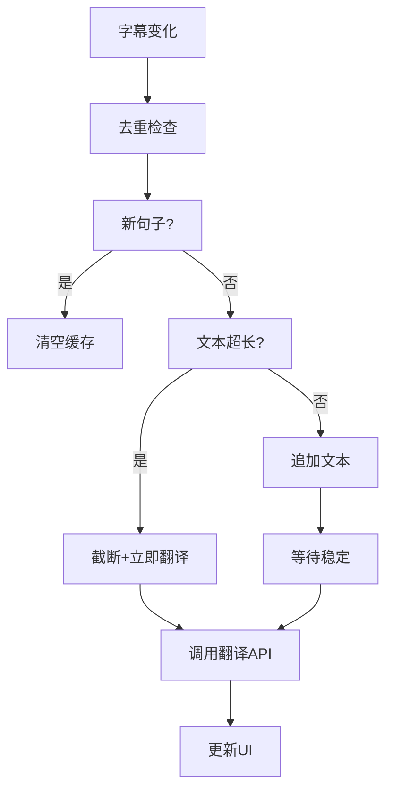

# 技术架构文档

## 目录

- [架构概述](#架构概述)
- [技术栈](#技术栈)
- [系统架构](#系统架构)
- [核心模块](#核心模块)
- [数据流](#数据流)
- [关键算法](#关键算法)
- [性能优化](#性能优化)
- [部署架构](#部署架构)

## 架构概述

YouTube Live Translate 采用 Chrome Extension Manifest V3 架构，分为三个主要部分：

1. **Content Script** - 注入到 YouTube 页面，负责字幕监听和翻译显示
2. **Popup** - 用户设置界面，使用 React 构建
3. **Background Service Worker** - 后台服务，处理扩展生命周期

```
┌─────────────────────────────────────────────────────┐
│                    Chrome Browser                    │
├─────────────────────────────────────────────────────┤
│                                                     │
│  ┌──────────────┐         ┌──────────────┐         │
│  │   Popup      │         │  Background  │         │
│  │   (React)    │◄───────►│  (Worker)    │         │
│  └──────────────┘         └──────────────┘         │
│         ▲                                           │
│         │ chrome.storage                           │
│         │                                           │
│  ┌──────┴─────────────────────────────────────┐    │
│  │         YouTube Page                         │    │
│  │  ┌──────────────────────────────────────┐  │    │
│  │  │     Content Script (TypeScript)      │  │    │
│  │  │  - 字幕监听  - 翻译处理  - UI 渲染   │  │    │
│  │  └──────────────────────────────────────┘  │    │
│  └─────────────────────────────────────────────┘    │
│                                                     │
└─────────────────────────────────────────────────────┘
         │
         ▼
  ┌─────────────┐
  │ Google Translate │
  │     API      │
  └─────────────┘
```

## 技术栈

### 前端框架

| 技术 | 版本 | 用途 |
|------|------|------|
| React | 18.x | UI 框架 |
| TypeScript | 5.x | 类型安全 |
| Webpack | 5.x | 模块打包 |
| sharp | 0.33 | 图标与 Social preview 图生成 |

### Chrome API

| API | 用途 |
|-----|------|
| `chrome.storage.sync` | 存储用户设置和位置信息 |
| `chrome.runtime` | 扩展间通信 |

### 外部服务

| 服务 | 用途 |
|------|------|
| Google Translate API | 翻译服务 |

### 开发工具

| 工具 | 用途 |
|------|------|
| ts-loader | TypeScript 编译 |
| npm | 包管理 |
| Git | 版本控制 |
| Node (scripts) | 图标与 social-preview 生成 |

## 系统架构

### 文件结构

```
youtube-live-translate/
├── public/                  # 静态资源
│   ├── manifest.json       # 扩展配置清单
│   └── icons/              # 图标资源（由 scripts/generate-icons.js 生成）
│       ├── icon.svg         # 矢量源
│       ├── icon16.png      # 16x16
│       ├── icon32.png      # 32x32
│       ├── icon48.png      # 48x48
│       ├── icon128.png     # 128x128
│       └── icon512.png     # 512x512（含 GitHub 等用途）
│
├── scripts/                # 构建前脚本
│   ├── generate-icons.js   # 从 icon.svg 生成多尺寸 PNG
│   └── generate-social-preview.js  # 生成 1280×640 social-preview.png
│
├── src/                    # 源代码
│   ├── popup/              # 弹窗界面（i18n: en/zh-CN/zh-TW）
│   │   ├── App.tsx         # 主组件
│   │   ├── index.tsx       # 入口文件
│   │   ├── popup.css       # 样式文件
│   │   └── locales.ts     # 界面文案多语言
│   │
│   ├── content/            # 内容脚本
│   │   └── index.tsx       # 核心逻辑
│   │
│   └── background/         # 后台脚本
│       └── index.ts        # Service Worker
│
├── dist/                   # 构建输出
│   ├── popup.html          # 弹窗 HTML
│   ├── popup.js            # 弹窗脚本
│   ├── content.js          # 内容脚本
│   ├── background.js       # 后台脚本
│   ├── manifest.json       # 复制的 manifest
│   └── icons/              # 复制的图标
│
├── webpack.config.js       # Webpack 配置
├── tsconfig.json           # TypeScript 配置
├── package.json            # 项目依赖
└── README.md               # 项目说明
```

### 模块划分

#### Content Script (src/content/index.tsx)

**职责**：
- 监听 YouTube 字幕变化
- 调用翻译 API
- 渲染字幕 UI
- 处理用户交互（拖拽、关闭等）

**主要类**：
```typescript
class SubtitleTranslator {
  // 状态管理（含 enabled, targetLang, showOriginal, hideOriginalSubtitles, textAlign, translatedFontSize）
  private state: TranslationState
  
  // UI 元素（wrapper 为全尺寸定位层，overlay 挂在其内，实现默认底部居中）
  private wrapper: HTMLDivElement
  private overlay: HTMLDivElement
  private subtitleBox: HTMLDivElement
  private originalLine: HTMLDivElement
  private translatedLine: HTMLDivElement
  
  // 定位（useDefaultPosition 为 true 时用 CSS 百分比居中）
  private position: SubtitlePosition
  private useDefaultPosition: boolean
  
  // 字幕监听
  private observer: MutationObserver
  private checkInterval: number
  
  // 播放器查找（含 Shadow DOM）与 overlay 创建重试
  private findPlayer(): HTMLElement | null
  private createOverlayAttempts: number
  
  // 翻译
  private cache: TranslationCache
  private translationQueue: Set<string>
}
```

#### Popup (src/popup/App.tsx)

**职责**：
- 显示设置界面
- 处理用户配置
- 与 Content Script 通信

**主要组件**：
```typescript
const App: React.FC = () => {
  const [state, setState] = useState<PopupState>({
    uiLanguage: 'en',        // 界面语言：en | zh-CN | zh-TW
    enabled: true,
    targetLang: 'zh-CN',
    showOriginal: false,
    hideOriginalSubtitles: false,
    textAlign: 'center',
    translatedFontSize: 'medium',
  });
  
  // 处理函数
  const handleToggle = () => { ... }
  const handleUiLanguageChange = () => { ... }
  const handleLanguageChange = () => { ... }
  const handleShowOriginalToggle = () => { ... }
  const handleHideOriginalSubtitlesToggle = () => { ... }
  const handleTextAlignChange = () => { ... }
  const handleTranslatedFontSizeChange = () => { ... }
}
```

#### Background (src/background/index.ts)

**职责**：
- 初始化扩展
- 处理扩展生命周期
- 响应浏览器事件

## 核心模块

### 1. 字幕监听模块

#### MutationObserver 模式

使用 `MutationObserver` 监听 DOM 变化：

```typescript
this.observer = new MutationObserver(() => {
  this.handleSubtitleChange(selector);
});

this.observer.observe(targetNode, {
  childList: true,
  subtree: true,
});
```

#### 选择器策略

```typescript
const selectors = [
  '.ytp-caption-segment',                // 字幕片段
  'caption-window.ytp-caption-window-bottom',  // 底部字幕窗口
  '.captions-text',                       // 字幕文本
  '.ytp-caption-window-container',        // 字幕容器
];
```

#### 定时器兜底

字幕轮询间隔 120ms，提高实时性：

```typescript
this.checkInterval = window.setInterval(() => {
  this.handleSubtitleChange(selector);
}, 120);
```

#### 播放器查找与 Shadow DOM

播放器可能位于 Shadow DOM 内，需优先查找 `#movie_player`，再在 `ytd-player.shadowRoot` 内查找；未找到时每 2 秒重试创建 overlay，最多 15 次。

### 2. 翻译模块

#### 翻译流程



#### API 调用

```typescript
private async translateText(text: string): Promise<string> {
  const url = `https://translate.googleapis.com/translate_a/single?client=gtx&sl=auto&tl=${this.state.targetLang}&dt=t&q=${encodeURIComponent(text)}`;
  
  const response = await fetch(url);
  const data = await response.json();
  
  if (data && data[0]) {
    return data[0].map((item: any) => item[0]).join('');
  }
  
  return text;
}
```

#### 序列号机制

防止旧翻译覆盖新翻译：

```typescript
private seq = 0;
private latestSeq = 0;

private async requestTranslation(text: string) {
  this.seq++;
  const currentSeq = this.seq;
  this.latestSeq = currentSeq;
  
  // ... 翻译处理 ...
  
  if (currentSeq === this.latestSeq) {
    this.updateTranslation(text, translated, currentSeq);
  } else {
    console.log(`丢弃过期翻译 [seq=${currentSeq}, latest=${this.latestSeq}]`);
  }
}
```

### 3. 缓存模块

#### LRU Cache 实现

```typescript
class TranslationCache {
  private cache = new Map<string, { text: string; timestamp: number }>();
  private readonly maxSize = 500;
  private readonly ttl = 1000 * 60 * 60 * 24; // 24小时
  
  get(sourceLang: string, targetLang: string, text: string): string | null {
    const key = this.getKey(sourceLang, targetLang, text);
    const item = this.cache.get(key);
    
    if (!item) return null;
    
    if (Date.now() - item.timestamp > this.ttl) {
      this.cache.delete(key);
      return null;
    }
    
    return item.text;
  }
  
  set(sourceLang: string, targetLang: string, text: string, translatedText: string): void {
    const key = this.getKey(sourceLang, targetLang, text);
    
    if (this.cache.size >= this.maxSize) {
      const firstKey = this.cache.keys().next().value;
      if (firstKey) {
        this.cache.delete(firstKey);
      }
    }
    
    this.cache.set(key, {
      text: translatedText,
      timestamp: Date.now(),
    });
  }
}
```

### 4. UI 渲染模块

#### DOM 结构

翻译控件挂载在播放器（`#movie_player` 或 `ytd-player`）下，通过全尺寸 wrapper 实现默认底部居中（`left: 50%` + `transform: translateX(-50%)` + `bottom: 120px`）：

```html
<!-- 播放器 #movie_player / ytd-player -->
<div id="yt-live-translate-wrapper">   <!-- 全尺寸定位层 100%×100% -->
  <div id="yt-live-translate-overlay">  <!-- 字幕 overlay，可拖拽 -->
    <div id="yt-live-translate-box">   <!-- 字幕框 -->
      <button>✕</button>               <!-- 关闭按钮，垂直居中、背景透明 -->
      <div id="yt-live-translate-original"></div>   <!-- 原文 -->
      <div id="yt-live-translate-translated"></div> <!-- 译文，字体大小可配置 -->
    </div>
  </div>
</div>
```

#### 样式实现

```typescript
this.subtitleBox.style.cssText = `
  background: rgba(0, 0, 0, 0.6);
  padding: 12px 20px;
  padding-top: 8px;
  border-radius: 8px;
  display: flex;
  flex-direction: column;
  gap: 4px;
  pointer-events: auto;
  position: relative;
  cursor: grab;
`;
```

### 5. 广告检测模块

#### 检测机制

```typescript
const checkForAds = () => {
  const adIndicators = [
    '.ytp-ad-player-overlay',      // 广告播放器覆盖层
    '.ytp-ad-preview-image',       // 广告预览图片
    '.ytp-ad-badge',                // 广告徽章
    '.ytp-ad-skip-button',          // 跳过广告按钮
    '.ytp-ad-text',                 // 广告文本
    '.ytp-ad-progress',             // 广告进度条
  ];
  
  let hasAdElements = false;
  for (const selector of adIndicators) {
    const element = document.querySelector(selector) as HTMLElement;
    if (element && element.offsetParent !== null) {
      hasAdElements = true;
      break;
    }
  }
  
  // 检查播放器类名
  const player = document.querySelector('#movie_player');
  if (player) {
    const playerClasses = player.classList;
    if (playerClasses.contains('ad-showing') || 
        playerClasses.contains('ad-interrupting')) {
      hasAdElements = true;
    }
  }
  
  // 处理广告状态变化
  if (hasAdElements && !this.isAdPlaying) {
    // 广告开始
    this.isAdPlaying = true;
    if (this.overlay) {
      this.overlay.style.display = 'none';
    }
  } else if (!hasAdElements && this.isAdPlaying) {
    // 广告结束
    this.isAdPlaying = false;
    if (this.overlay && !this.isClosed) {
      this.overlay.style.display = 'block';
    }
    this.updateOriginalSubtitlesVisibility();
  }
};
```

### 6. 拖拽模块

#### 事件处理

```typescript
private handleMouseDown(e: MouseEvent) {
  // 检查目标元素
  const target = e.target as HTMLElement;
  if (target.tagName === 'BUTTON' || 
      target.id === 'yt-live-translate-original' || 
      target.id === 'yt-live-translate-translated') {
    return;
  }
  
  e.preventDefault();
  e.stopPropagation();
  
  this.isDragging = true;
  
  // 计算偏移
  const rect = this.overlay.getBoundingClientRect();
  this.dragOffsetX = e.clientX - rect.left;
  this.dragOffsetY = rect.bottom - e.clientY;
  
  // 添加全局监听
  document.addEventListener('mousemove', this.handleMouseMove);
  document.addEventListener('mouseup', this.handleMouseUp);
}

private handleMouseMove = (e: MouseEvent) => {
  if (!this.isDragging || !this.overlay) return;
  
  const parent = this.overlay.parentElement;
  if (!parent) return;
  
  const parentRect = parent.getBoundingClientRect();
  
  // 计算新位置
  let newLeft = e.clientX - parentRect.left - this.dragOffsetX;
  let newBottom = parentRect.bottom - e.clientY - this.dragOffsetY;
  
  // 限制范围
  const maxLeft = parentRect.width - this.overlayWidth;
  const minLeft = 0;
  const maxBottom = parentRect.height - 50;
  const minBottom = 20;
  
  this.position.left = Math.max(minLeft, Math.min(newLeft, maxLeft));
  this.position.bottom = Math.max(minBottom, Math.min(newBottom, maxBottom));
  
  this.updateOverlayPosition();
};
```

#### 位置持久化

```typescript
private savePosition() {
  chrome.storage.sync.set({ position: this.position });
}

// 读取保存的位置
const result = await chrome.storage.sync.get(['position']);
if (result.position) {
  this.position = result.position;
}
```

## 数据流

### 字幕翻译数据流

```
YouTube 字幕 DOM
    ↓
MutationObserver / 定时器
    ↓
handleSubtitleChange()
    ↓
┌───────────────────┐
│  去重 + 节流检查   │
└───────────────────┘
    ↓
┌───────────────────┐
│  智能判断         │
│  - 新句子？        │
│  - 文本超长？      │
│  - 追加文本？      │
└───────────────────┘
    ↓
┌───────────────────┐
│  翻译决策          │
│  - 查询缓存        │
│  - 检查队列        │
│  - 限流检查        │
└───────────────────┘
    ↓
Google Translate API
    ↓
┌───────────────────┐
│  序列号验证        │
│  只接受最新结果    │
└───────────────────┘
    ↓
updateTranslation()
    ↓
更新 DOM
```

### 设置同步数据流

```
Popup UI
    ↓
用户操作
    ↓
chrome.storage.sync.set()
    ↓
┌──────────────────────────────┐
│   Content Script             │
│   chrome.storage.onChanged   │
│   ↓                          │
│   更新内部状态                │
│   - 应用新设置                │
│   - 重新渲染 UI               │
│   - 更新监听器                │
└──────────────────────────────┘
```

## 关键算法

### 1. 智能刷新算法

```typescript
private handleSubtitleChange(selector: string) {
  const currentText = this.extractText();
  
  // 节流：60ms 内只处理一次
  if (Date.now() - this.lastProcessTime < this.THROTTLE_DELAY) return;
  
  // 去重：相同文本不处理
  if (currentText === this.lastOriginalText) return;
  
  // 判断场景
  const isNewSentence = currentText.length < this.lastOriginalText.length;
  const isTooLong = currentText.length > 200;
  const isDifferent = !currentText.includes(this.lastOriginalText);
  
  let shouldRefreshUI = false;
  let shouldTranslateImmediately = false;
  
  if (isNewSentence) {
    // 新句子：刷新 UI
    shouldRefreshUI = true;
    this.lastTranslatedText = '';
  } else if (isTooLong) {
    // 文本过长：截断并立即翻译
    textToTranslate = this.truncateText(currentText, 150);
    shouldRefreshUI = true;
    shouldTranslateImmediately = true;
  } else if (isDifferent) {
    // 内容不同：刷新 UI
    shouldRefreshUI = true;
  } else {
    // 追加文本：不刷新 UI
    shouldRefreshUI = false;
  }
  
  // 根据决策执行操作
  if (shouldTranslateImmediately) {
    if (textToTranslate !== this.lastTranslatedText) {
      this.requestTranslation(textToTranslate);
    }
  } else if (shouldRefreshUI) {
    // 设置 debounce 定时器（180ms）
    this.debounceTimer = setTimeout(() => {
      this.requestTranslation(textToTranslate);
    }, this.DEBOUNCE_DELAY);
  }
}
```

### 2. 文本截断算法

```typescript
private truncateText(text: string, maxLength: number): string {
  const truncated = text.slice(-maxLength);
  
  // 在单词边界处截断
  const firstSpace = truncated.indexOf(' ');
  if (firstSpace > 0 && firstSpace < 50) {
    return truncated.slice(firstSpace + 1);
  }
  
  return truncated;
}
```

### 3. 广告检测算法

```typescript
private setupAdDetection() {
  const checkForAds = () => {
    // 多维度检测
    let hasAdElements = false;
    
    // 1. 检测广告元素
    for (const selector of AD_INDICATORS) {
      const element = document.querySelector(selector);
      if (element && element.offsetParent !== null) {
        hasAdElements = true;
        break;
      }
    }
    
    // 2. 检测播放器类名
    const player = document.querySelector('#movie_player');
    if (player && (
      player.classList.contains('ad-showing') ||
      player.classList.contains('ad-interrupting')
    )) {
      hasAdElements = true;
    }
    
    // 状态变化处理
    if (hasAdElements && !this.isAdPlaying) {
      this.isAdPlaying = true;
      this.hideOverlay();
    } else if (!hasAdElements && this.isAdPlaying) {
      this.isAdPlaying = false;
      this.showOverlay();
      this.updateOriginalSubtitlesVisibility();
    }
  };
  
  // 每秒检查
  setInterval(checkForAds, 1000);
}
```

## 性能优化

### 1. 节流与防抖

| 策略 | 延迟 | 用途 |
|------|------|------|
| Throttle | 60ms | 限制字幕检测频率 |
| Debounce | 180ms | 等待字幕稳定后翻译 |
| Rate Limit | 500ms | 翻译请求间隔 |

### 2. 缓存策略

```typescript
// LRU Cache
class TranslationCache {
  private readonly maxSize = 500;    // 最多 500 条
  private readonly ttl = 24 * 3600 * 1000;  // 24 小时
}
```

### 3. 队列管理

```typescript
// 避免重复翻译
private translationQueue = new Set<string>();

// 检查队列
if (this.translationQueue.has(text)) {
  return; // 已在队列中
}

// 添加到队列
this.translationQueue.add(text);
```

### 4. 序列号机制

```typescript
// 只接受最新的翻译结果
if (currentSeq === this.latestSeq) {
  this.updateTranslation(text, translated, currentSeq);
} else {
  // 丢弃过期结果
}
```

### 5. MutationObserver 优化

```typescript
// 精确的监听范围
this.observer.observe(targetNode, {
  childList: true,    // 只监听子元素变化
  subtree: true,      // 监听所有后代
  // 不监听 attributes、characterData 等
});
```

## 部署架构

### 构建流程

```
源代码 (TypeScript + React)
    ↓
Webpack 打包
    ├─ ts-loader (TypeScript 编译)
    ├─ css-loader (样式处理)
    └─ copy-webpack-plugin (静态资源)
    ↓
输出 (JavaScript + HTML + CSS)
    ├─ popup.html + popup.js
    ├─ content.js
    ├─ background.js
    └─ icons/
    ↓
Chrome Extension
```

### 发布流程

1. **开发测试**
   ```bash
   npm run dev  # 开发模式
   ```

2. **生产构建**
   ```bash
   npm run build  # 生产构建
   ```

3. **打包**
   ```bash
   zip -r youtube-live-translate.zip dist/
   ```

4. **发布**
   - 上传到 Chrome Web Store
   - 或直接分发 zip 文件

### 环境隔离

| 环境 | 用途 | 命令 |
|------|------|------|
| Development | 开发调试 | `npm run dev` |
| Production | 生产构建 | `npm run build` |

## 安全考虑

### 1. CSP (Content Security Policy)

使用内联样式，避免外部脚本注入。

### 2. 最小权限

```json
{
  "permissions": [
    "storage",      // 仅存储
    "activeTab"     // 仅当前标签
  ],
  "host_permissions": [
    "https://www.youtube.com/*",           // 仅 YouTube
    "https://translate.googleapis.com/*"  // 仅翻译 API
  ]
}
```

### 3. 数据隐私

- 所有数据存储在本地（chrome.storage.sync）
- 不收集用户信息
- 不上传到第三方服务器（除 Google Translate）

## 扩展性设计

### 1. 语言扩展

在 `src/popup/App.tsx` 添加新语言：

```typescript
const TARGET_LANGUAGES = [
  // ... 现有语言
  { code: 'pt', name: 'Português' },
  { code: 'it', name: 'Italiano' },
];
```

### 2. 翻译服务替换

修改 `translateText` 方法：

```typescript
private async translateText(text: string): Promise<string> {
  // 使用其他翻译服务
  const url = `https://api.example.com/translate`;
  // ...
}
```

### 3. UI 定制

修改 CSS 变量或样式常量：

```typescript
private readonly STYLES = {
  backgroundColor: 'rgba(0, 0, 0, 0.6)',
  textColor: 'white',
  fontSize: 18,
  // ...
};
```

## 监控与日志

### 日志级别

```typescript
console.log('[YouTube Live Translate] 信息');
console.warn('[YouTube Live Translate] 警告');
console.error('[YouTube Live Translate] 错误');
```

### 关键日志点

- 初始化：`[YouTube Live Translate] 初始化中...`
- 字幕变化：`[YouTube Live Translate] 检测到字幕变化:`
- 翻译请求：`[YouTube Live Translate] 请求翻译 [seq=N]:`
- 翻译完成：`[YouTube Live Translate] 翻译完成 [seq=N]:`
- 广告检测：`[YouTube Live Translate] 检测到广告开始`
- 拖拽操作：`[YouTube Live Translate] 开始拖拽`

---

**文档版本**: 1.0.0  
**最后更新**: 2026-02-08  
**维护者**: YouTube Live Translate Team
