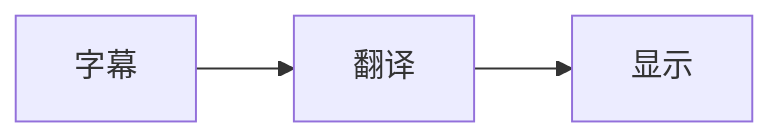

# 📚 YouTube Live Translate 文档索引

欢迎来到 YouTube Live Translate 的文档中心！这里包含了项目的所有技术文档、使用指南和开发资源。

## 📖 文档导航

### 🚀 快速开始

1. **[README.md](../README.md)** - 项目总览和快速开始指南
   - 功能介绍
   - 安装方法
   - 使用说明
   - 开发指南

### 📋 详细文档

#### [产品功能文档](PRODUCT.md)
👉 **适合：用户、产品经理、测试人员**

内容概览：
- ✨ 核心功能详解
- 🎛️ 用户界面说明
- 📝 使用指南
- 💡 常见问题解答
- 🌐 支持语言列表

**核心章节**：
- 实时字幕翻译原理
- 双行显示模式
- 拖拽定位功能
- 广告检测机制
- 快捷键使用

#### [技术架构文档](ARCHITECTURE.md)
👉 **适合：开发者、架构师、技术负责人**

内容概览：
- 🏗️ 系统架构设计
- 🧩 模块划分
- 📊 数据流图
- 🔧 关键算法
- ⚡ 性能优化方案

**核心章节**：
- Chrome Extension 架构
- Content Script 核心逻辑
- 翻译模块实现
- 缓存策略（LRU）
- 智能刷新算法

#### [测试文档](TESTING.md)
👉 **适合：QA工程师、测试人员**

内容概览：
- 🧪 测试策略
- ✅ 测试清单
- 🤖 自动化测试
- 📈 性能测试
- 🌐 兼容性测试

**核心章节**：
- 单元测试示例
- 手动测试用例
- 回归测试流程
- 边界条件测试
- CI/CD 配置

#### [API 文档](API.md)
👉 **适合：开发者、贡献者**

内容概览：
- 🔌 Chrome Storage API
- 🎭 Content Script API
- 🖼️ Popup API
- 💬 消息传递机制
- 📐 接口定义

**核心章节**：
- 接口定义（TypeScript）
- 方法签名和参数
- 使用示例代码
- 错误处理
- 扩展开发指南

#### [更新日志](CHANGELOG.md)
👉 **适合：所有用户**

内容概览：
- 🎉 版本历史
- ✨ 新增功能
- 🐛 问题修复
- ⚡ 性能优化
- 🔒 安全更新

**版本规则**：
- 遵循语义化版本 (Semantic Versioning)
- MAJOR.MINOR.PATCH
- 详细的变更记录

## 🎯 按角色查看文档

### 👨‍💻 开发者

推荐阅读顺序：
1. README.md - 了解项目
2. ARCHITECTURE.md - 理解架构
3. API.md - 学习接口
4. TESTING.md - 编写测试

### 🧪 测试人员

推荐阅读顺序：
1. PRODUCT.md - 了解功能
2. TESTING.md - 执行测试
3. CHANGELOG.md - 查看变更

### 👨‍💼 产品经理

推荐阅读顺序：
1. README.md - 产品概览
2. PRODUCT.md - 功能详解
3. CHANGELOG.md - 版本规划

### 👨‍🎨 设计师

推荐阅读顺序：
1. PRODUCT.md - 了解界面
2. ARCHITECTURE.md - 理解结构

## 📊 项目统计

| 指标 | 数值 |
|------|------|
| 代码行数 | ~1050 行（content/index.tsx） |
| 核心模块 | 3 个 |
| 支持语言 | 10 种 |
| 文档数量 | 5 份 |
| 快捷键 | 1 个（Modifier+E 开启/关闭插件） |
| 设置项 | 6 项（启用、目标语言、原文、隐藏原字幕、对齐、译文字体大小） |

## 🔗 快速链接

### 开发相关

- **项目仓库**: [GitHub](https://github.com/yourusername/youtube-live-translate)
- **问题反馈**: [Issues](https://github.com/yourusername/youtube-live-translate/issues)
- **Chrome Web Store**: [商店链接](https://chrome.google.com/webstore)

### 技术资源

- [Chrome Extension 文档](https://developer.chrome.com/docs/extensions/)
- [React 文档](https://react.dev/)
- [TypeScript 文档](https://www.typescriptlang.org/)
- [Webpack 文档](https://webpack.js.org/)

### 学习资源

- [Chrome Extension 开发教程](https://developer.chrome.com/docs/extensions/mv3/getstarted/)
- [React 官方教程](https://react.dev/learn)
- [TypeScript 手册](https://www.typescriptlang.org/docs/handbook/intro.html)

## 📝 文档规范

### Markdown 语法

本文档使用 Markdown 语法，推荐编辑器：
- VS Code + Markdown Preview Enhanced
- Typora
- MacDown

### 代码高亮

代码块使用语法高亮：
```` ```typescript
// TypeScript 代码
`` ```
```

### 图表支持

使用 ASCII 艺术（本示例）或 Mermaid 图表：
```

```

## 🤝 贡献文档

欢迎改进文档！请遵循以下规范：

1. **清晰准确**：信息准确，描述清晰
2. **示例完整**：代码示例可直接运行
3. **图表直观**：图表辅助说明
4. **中英文对照**：技术术语保留原文

## 📮 联系方式

如有疑问，请通过以下方式联系：

- 📧 Email: your.email@example.com
- 🐛 Issues: [GitHub Issues](https://github.com/yourusername/youtube-live-translate/issues)
- 💬 Discussions: [GitHub Discussions](https://github.com/yourusername/youtube-live-translate/discussions)

---

**最后更新**: 2026-02-07  
**文档版本**: 1.0.0  
**维护团队**: YouTube Live Translate Team
